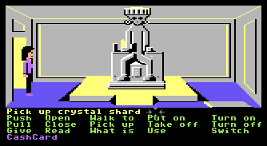

# zmk64_fix
Fix for the C64 version of Zak McKracken to re-empower Annie 
A bug in the original C64 version of Zak McKracken recenty surfaced during a live playthrough
[YouTube Conversations with Curtis](https://www.youtube.com/watch?v=HJ5CpEy4sio).
It prevented Annie from picking up in yellow crystal shard.
In most user experiences and playthroughs this action is carried out by Zak, though, which is why this bug remained unknown
for 36 years.

From the live audience the user ATM confirmed this bug to be present for the V1 versions of the game. Namely, C64 and the first MS-DOS variant.
Robert Megone hunted down the corresponding SCUMM script with its changes between V1 and V2:

The scene in question:


Buggy script:
```js
[0000] (48) if (VAR_ACTIVE_VERB == 14) {
[0006] (08)   if (VAR_EGO != 2) {
[000C] (2F)     if (!getState04(169)) {
[0011] (6F)       if (getState04(114)) {
[0016] (D8)         printEgo("This looks like an artifact!");
[0030] (18)       } else {
[0033] (D8)         printEgo("I wonder who would know what this is.");
[0053] (**)       }
[0053] (**)     }
[0053] (D0)     pickupObject(VAR_ACTIVE_OBJECT1);
[0055] (62)     stopScript(0);
[0057] (**)   }
[0057] (**) }
```

The `pickupObject` is only carried out for actors that are not Annie (`VAR_EGO != 2`).

Working script of V2:
```js
[0000] (48) if (VAR_ACTIVE_VERB == 14) {
[0006] (D0)   pickupObject(VAR_ACTIVE_OBJECT1);
[0008] (08)   if (VAR_EGO != 2) {
[000E] (2F)     if (!getState04(169)) {  #a9
[0013] (6F)       if (getState04(114)) { #72
[0018] (D8)         printEgo("This looks like an artifact!");
[0032] (18)       } else {
[0035] (D8)         printEgo("I wonder who would know what this is.");
[0055] (**)       }
[0055] (**)     }
[0055] (62)     stopScript(0);
[0057] (**)   }
[0057] (**) }
```

The next step was to locate the corresponding byte code of this script in the C64 game data.
It resides on disk 2.
The buggy byte code:

```js
75
48 08 0e 00 51 00           #[0000] (48) if (VAR_ACTIVE_VERB == 14) {
08 00 02 00 4b 00           #[0008] (08)   if (VAR_EGO != 2) {
2f a9 00 42 00              #[000E] (2F)     if (!getState04(169)) {  #a9
6f 72 00 1d 00              #[0013] (6F)       if (getState04(114)) { #72
d8 54 68 69 f3 6c 6f 6f 6b
f3 6c 69 6b e5 61 ee 61 72
74 69 66 61 63 74 21 00     #[0018] (D8) printEgo("This looks like an artifact!");
18 20 00                    #[0032] (18)       } else {
d8 c9 77 6f 6e 64 65 f2 77
68 ef 77 6f 75 6c e4 6b 6e
6f f7 77 68 61 f4 74 68 69
f3 69 73 2e 00              #[0035] (D8) printEgo("I wonder who would know what this is.");
d0 09                       #(D0)   pickupObject(VAR_ACTIVE_OBJECT1);}
62 00                       #[0055] (62)     stopScript(0);
```

The new data after the patch was applied:
```js
77
48 08 0e 00 51 00           #[0000] (48) if (VAR_ACTIVE_VERB == 14) {
d0 09                       #(D0)   pickupObject(VAR_ACTIVE_OBJECT1);}
08 00 02 00 49 00           #[0008] (08)   if (VAR_EGO != 2) {
2f a9 00 42 00              #[000E] (2F)     if (!getState04(169)) {  #a9
6f 72 00 1d 00              #[0013] (6F)       if (getState04(114)) { #72
d8 54 68 69 f3 6c 6f 6f 6b
f3 6c 69 6b e5 61 ee 61 72
74 69 66 61 63 74 21 00     #[0018] (D8) printEgo("This looks like an artifact!");
18 20 00                    #[0032] (18)       } else {
d8 c9 77 6f 6e 64 65 f2 77
68 ef 77 6f 75 6c e4 6b 6e
6f f7 77 68 61 f4 74 68 69
f3 69 73 2e 00              #[0035] (D8) printEgo("I wonder who would know what this is.");
62 00                       #[0055] (62)     stopScript(0);
```

Note, that the `pickupObject` was injected earlier, causing the relative jump to the end of the the second IF CLAUSE to become shorter by two bytes
(`0x4b` -> `0x49`) which also affected the script EOR checksum and required a change from `0x75` to `0x77` to produce a valid byte code.
The patched disk image was confirmed to fix the issue and allow a complete playthrough of this incredibly amazing game.

## Credits
- bug hunt: Robert Megone & user ATM 
- C64 patch: Martin Wendt
